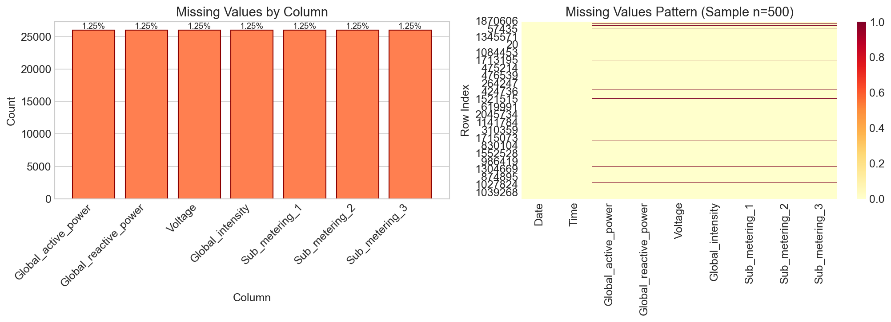
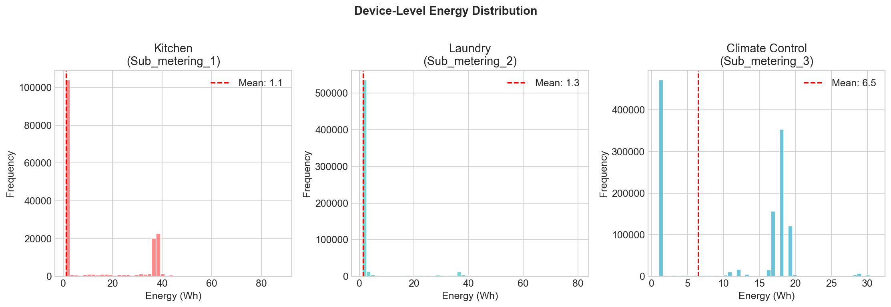
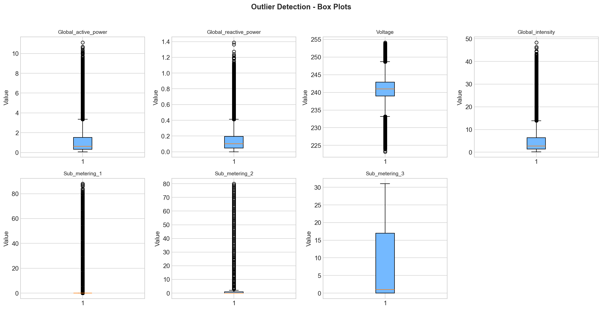
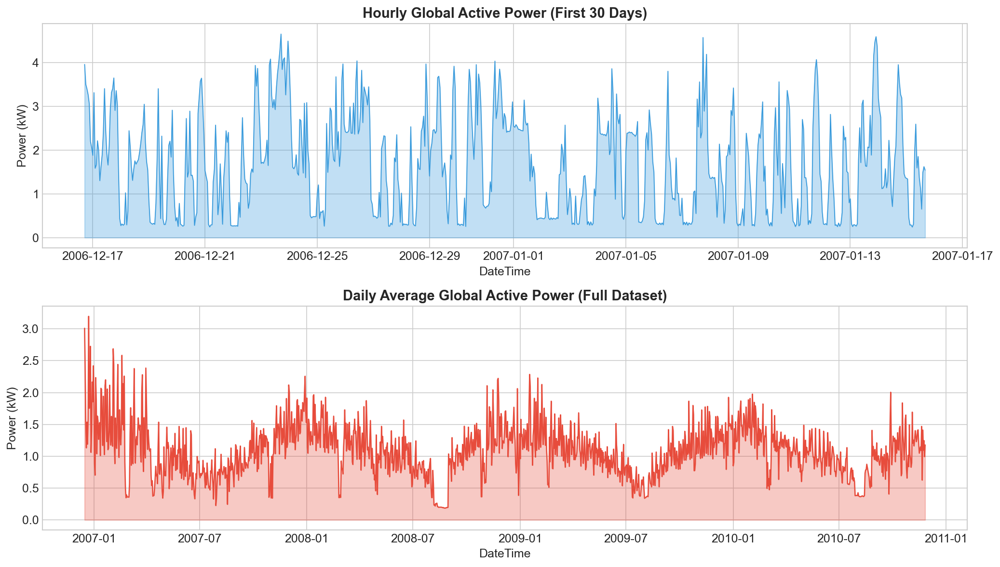
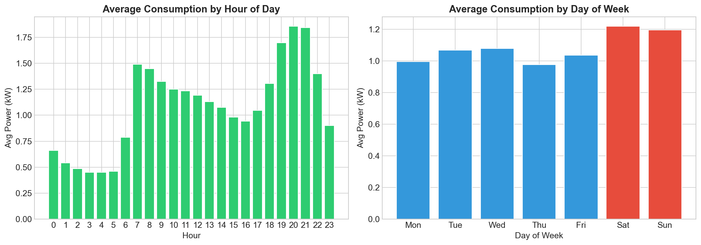
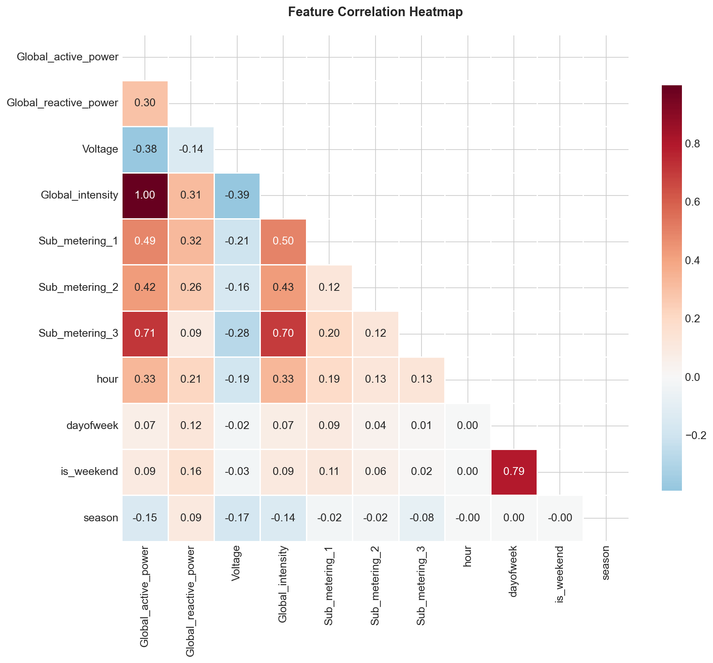
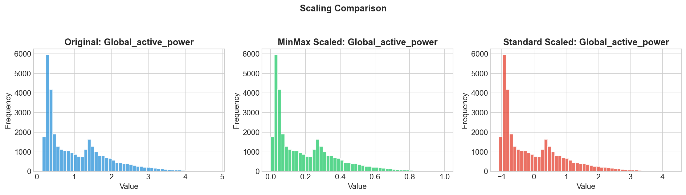
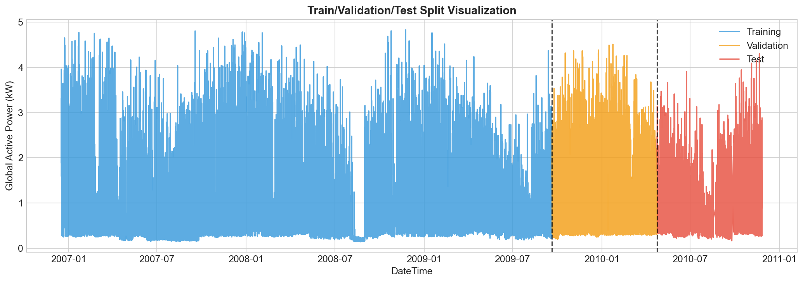

# 🔋 Milestone 1: Data Collection, Understanding & Preprocessing

## Week 1-2 Deliverables

This folder contains the complete implementation of **Milestone 1** for the Smart Energy Consumption Analysis project.

---

## 📁 Folder Structure

```
Milestone 1/
├── milestone1.ipynb              # Main notebook
├── images/                       # Saved visualizations
│   ├── 01_missing_values_analysis.png
│   ├── 02_device_level_distribution.png
│   ├── 03_outlier_detection.png
│   ├── 04_resampled_time_series.png
│   ├── 05_consumption_patterns.png
│   ├── 06_correlation_heatmap.png
│   ├── 07_scaling_comparison.png
│   └── 08_data_split_visualization.png
├── README.md                     # This file
└── requirements.txt              # Dependencies
```

---

## 🎯 Modules Completed

### Module 1: Data Collection and Understanding
- ✅ Loaded 2,075,259 minute-level energy consumption records
- ✅ Verified data integrity and identified 1.25% missing values
- ✅ Organized device-level data (Kitchen, Laundry, Climate Control)
- ✅ Performed comprehensive exploratory data analysis

### Module 2: Data Cleaning and Preprocessing
- ✅ Handled missing values using interpolation and forward/backward fill
- ✅ Detected and treated outliers using IQR method and Winsorization
- ✅ Created DateTime index and extracted temporal features
- ✅ Resampled data to hourly and daily granularity
- ✅ Applied MinMax and Standard scaling for normalization
- ✅ Split data into train (70%), validation (15%), test (15%) sets

---

## 📊 Visualizations

### Missing Values Analysis


### Device-Level Distribution


### Outlier Detection


### Resampled Time Series


### Consumption Patterns


### Correlation Heatmap


### Scaling Comparison


### Data Split Visualization


---

## 🔧 How to Run

1. Ensure the dataset `household_power_consumption.txt` is in the parent directory
2. Install dependencies: `pip install -r requirements.txt`
3. Open and run `milestone1.ipynb` in Jupyter Notebook

---

**Author:** Suraj Surve  
**Date:** January 2026
