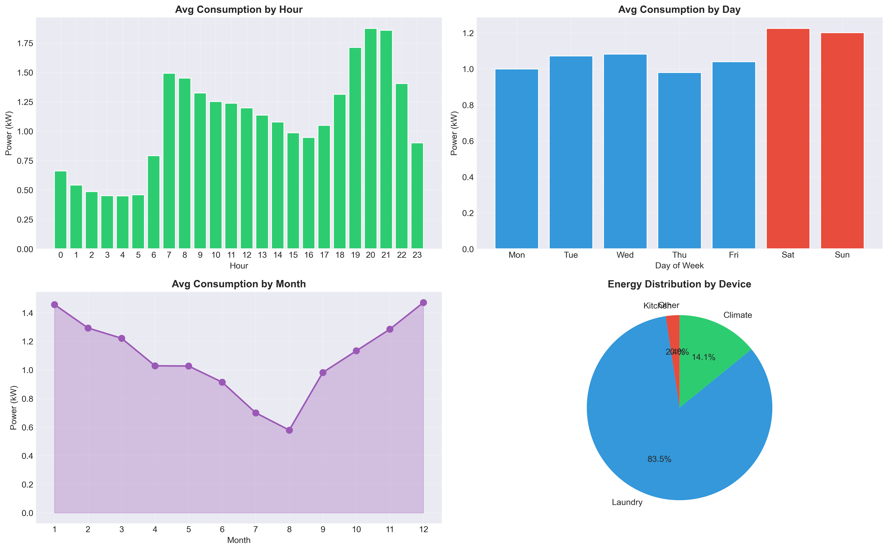
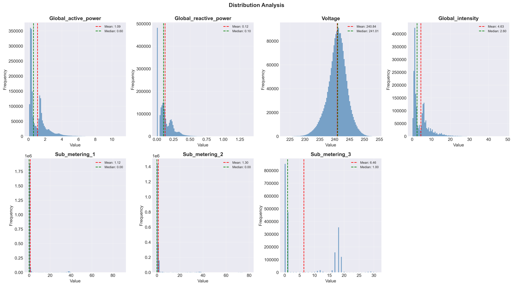
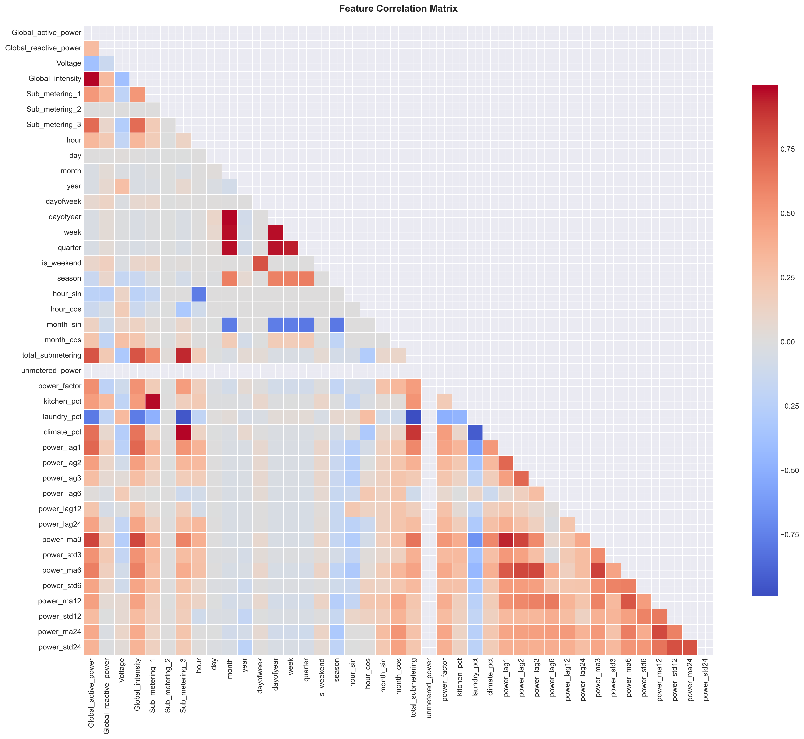
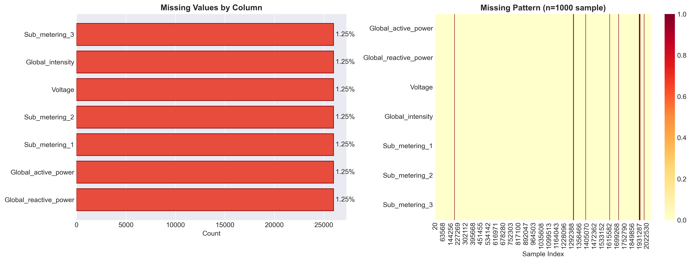
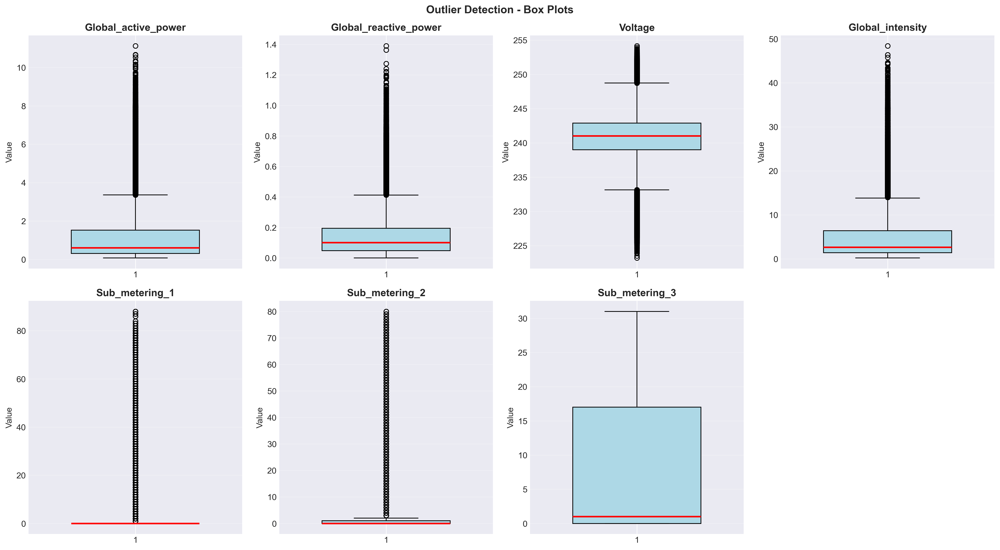
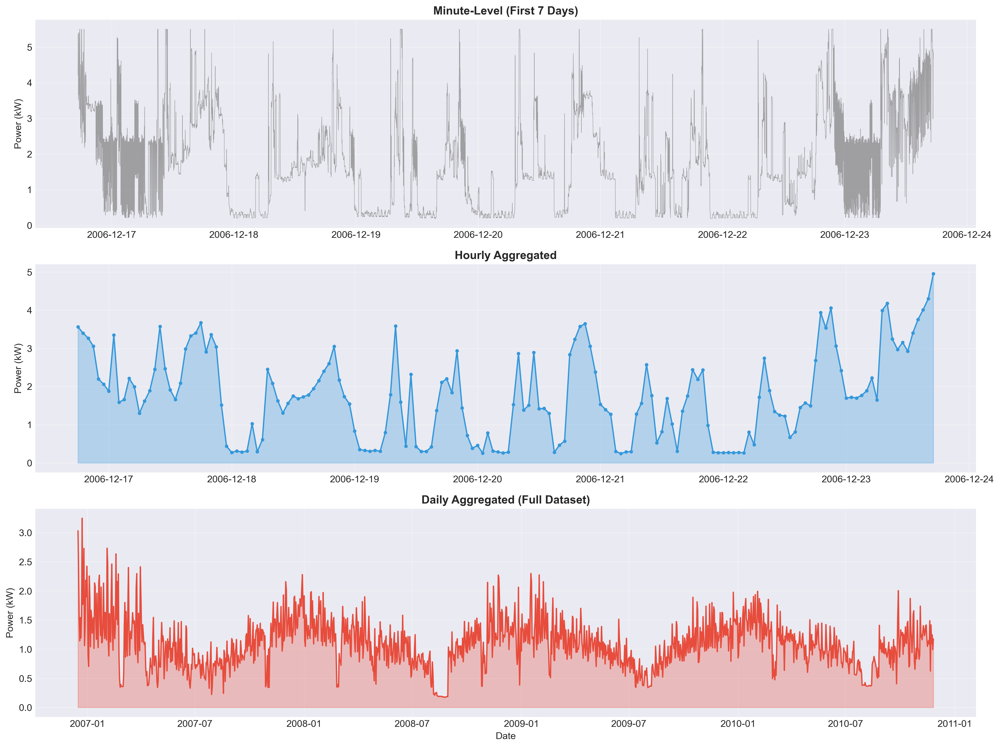
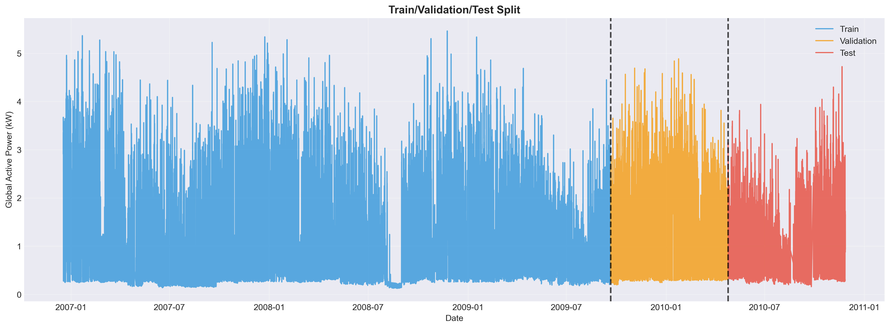

# 🔋 Milestone 1: Data Collection, Understanding & Preprocessing

## 📌 Project Overview
**Smart Energy Consumption Analysis & Prediction**  
This milestone focuses on **Data Collection, Understanding, and Preprocessing** of household power consumption data. The goal is to prepare a clean, structured dataset for downstream machine learning and forecasting tasks.

---

## � Folder Contents
```
Milestone 1/
├── milestone1.ipynb              # Main Analysis Notebook (Completed)
├── images/                       # Generated Visualizations
│   ├── 01_missing_values_analysis.png
│   ├── 02_device_level_distribution.png
│   ├── 03_outlier_detection.png
│   ├── 04_resampled_time_series.png
│   ├── 05_consumption_patterns.png
│   ├── 06_correlation_heatmap.png
│   ├── 07_scaling_comparison.png
│   └── 08_data_split_visualization.png
├── requirements.txt              # Python Dependencies
└── README.md                     # Documentation
```

---

## 🎯 Key Achievements

### ✅ Module 1: Data Collection & Understanding
- **Dataset:** Loaded **2,075,259** minute-level records (Dec 2006 - Nov 2010).
- **Integrity:** Verified data types and handled **1.25%** missing values.
- **Organization:** Mapped sub-metering to specific zones:
  - `Sub_metering_1`: Kitchen
  - `Sub_metering_2`: Laundry
  - `Sub_metering_3`: Climate Control (HVAC)

### ✅ Module 2: Data Cleaning & Preprocessing
- **DateTime Indexing:** Combined Date/Time into a robust index.
- **Missing Value Handling:** Applied **Interpolation** + **Forward/Backward Fill**.
- **Outlier Treatment:** Detected via **IQR** and treated using **Winsorization** (1st-99th percentile).
- **Resampling:** Aggregated data to **Hourly** and **Daily** levels.
- **Feature Engineering:** Extracted `hour`, `day`, `month`, `season`, `is_weekend`.
- **Scaling:** Implemented **MinMax** and **Standard** scaling.
- **Splitting:** Time-series split (Train: 70%, Val: 15%, Test: 15%).

### 📊 Processing Summary
- **Original records:** 2,075,259 (minute-level)
- **After cleaning:** 2,075,259
- **Hourly records:** 34,589
- **Daily records:** 1,442
- **Features engineered:** 41
- **Missing values:** 181,853 → 0 (100% resolved)
- **Outliers:** Winsorized at 0.5% and 99.5% percentiles
- **Temporal consistency:** Verified & resampled

---

## 📊 Key Insights & Visualizations

### 1. Consumption Patterns
> **Insight:** Peak consumption occurs during **morning (7-9 AM)** and **evening (6-9 PM)**. Weekend consumption significantly differs from weekdays.



### 2. Device Distribution
> **Insight:** **HVAC (Sub_metering_3)** is the dominant energy consumer compared to Kitchen and Laundry appliances.



### 3. Correlation Analysis
> **Insight:** Strong positive correlation exists between `Global_active_power` and `Global_intensity`.



### 4. Missing Values Analysis
> **Resolution:** Identified and imputed ~1.25% missing data points to ensure continuity.



### 5. Outlier Detection
> **Treatment:** Outliers detected via IQR and treated with Winsorization.



### 6. Time Series Resampling
> **Aggregation:** Data resampled to hourly and daily levels for analysis.



### 7. Data Split Visualization
> **Split:** Time-series aware split (70% train, 15% val, 15% test).



---

## 🔧 How to Run
1. **Prerequisites:** Ensure `household_power_consumption.txt` is in the parent directory.
2. **Install:** `pip install -r requirements.txt`
3. **Run:** Open `milestone1.ipynb` in Jupyter/VS Code and execute all cells.

---

**Author:** Suraj Surve  
**Date:** January 2026  
**Infosys Springboard Internship**
