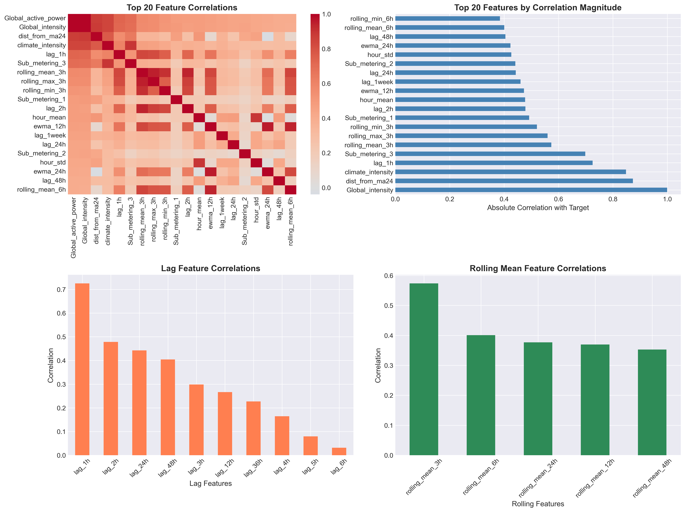
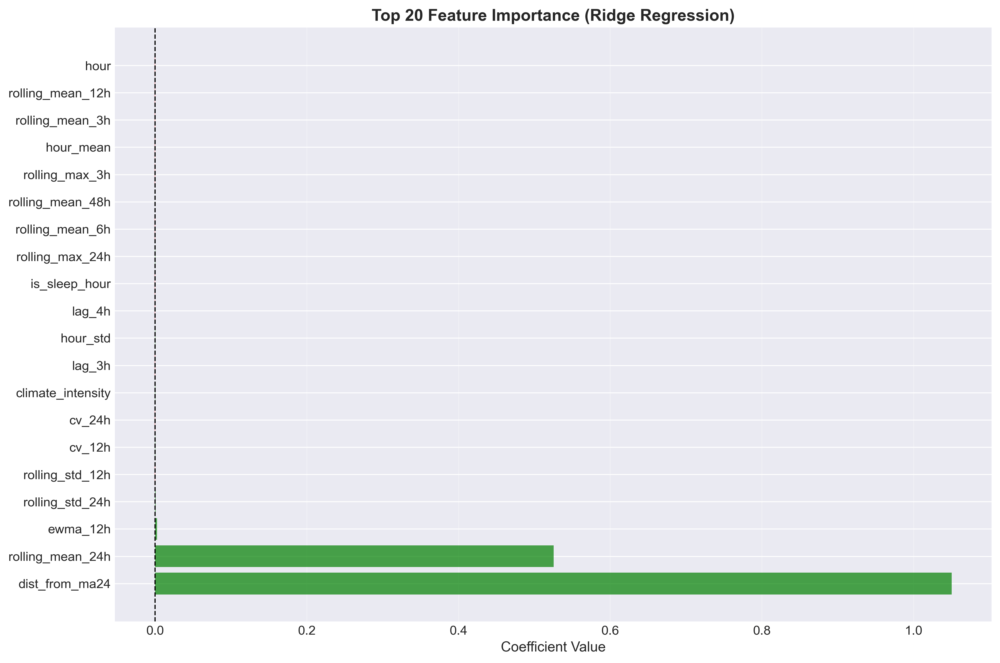
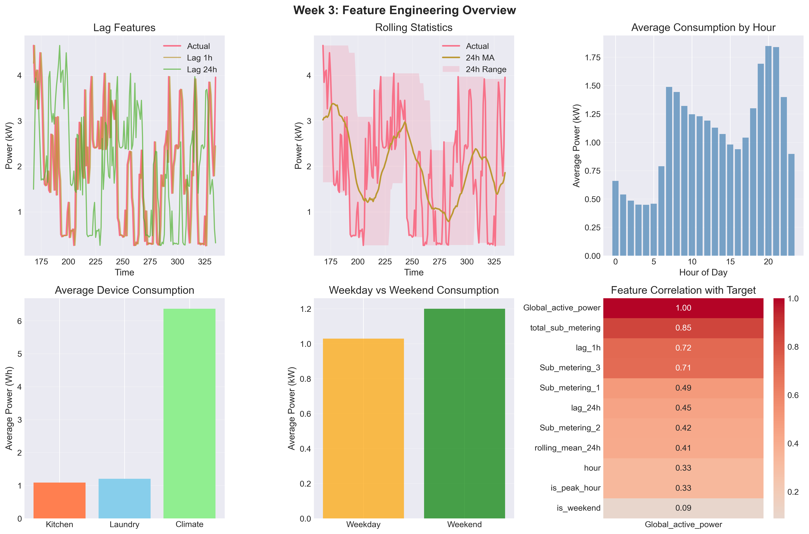
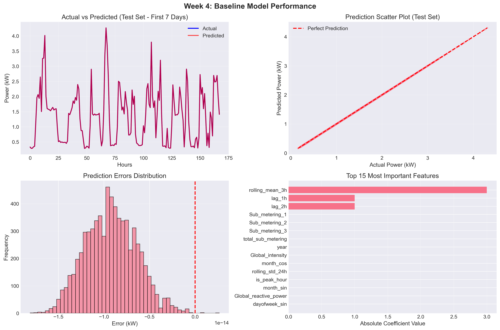
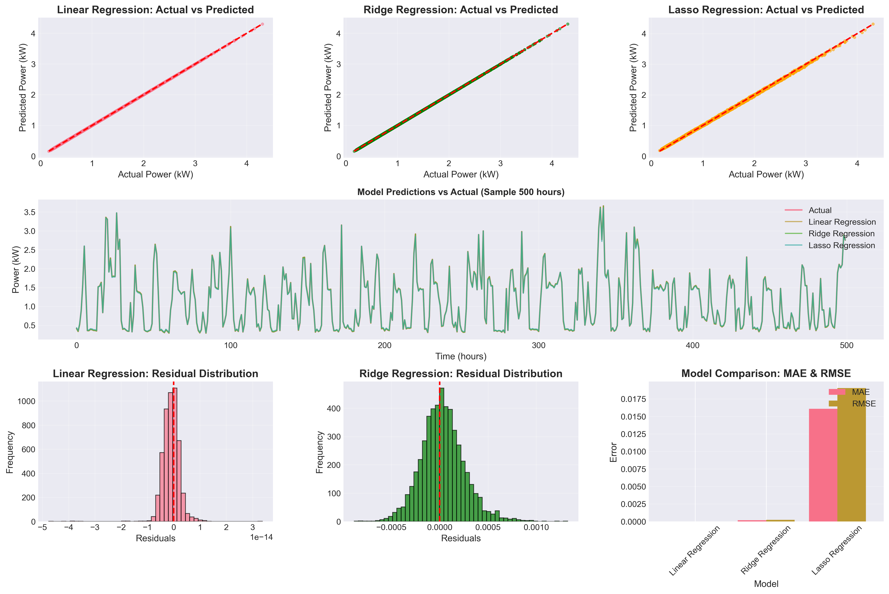

# 🔮 Milestone 2: Feature Engineering & Baseline Modeling

## 📌 Project Overview
**Smart Energy Consumption Analysis & Prediction**  
This milestone focuses on **Feature Engineering** and developing a **Baseline Regression Model** for predicting household energy consumption. We build upon the cleaned dataset from Milestone 1 to create predictive features and evaluate initial model performance.

---

## 📂 Folder Contents
```
Milestone 2/
├── milestone2.ipynb              # Main Modeling Notebook (Completed)
├── selected_features.txt         # List of Selected Features
├── images/                       # Generated Visualizations
│   ├── 09_device_hourly_avg.png
│   └── 10_actual_vs_predicted.png
├── baseline_model_results.png    # Model Performance Summary
├── baseline_ridge_model.pkl      # Trained Model (Pickle)
├── feature_correlation_analysis.png
├── feature_importance.png
├── feature_scaler.pkl            # Feature Scaler (Pickle)
├── week3_feature_engineering.png
├── week4_baseline_model_results.png
└── README.md                     # Documentation
```

---

## 🎯 Key Achievements

### ✅ Week 3: Feature Engineering
- **Temporal Features:** Added cyclical encoding for hour/month, weekend indicators.
- **Lag Features:** Created 1-24 hour lags, moving averages, and standard deviations.
- **Device-Level Aggregation:** Computed percentages for kitchen, laundry, climate control.
- **Feature Selection:** Identified top 20 features using correlation and importance analysis.
- **Scaling:** Applied StandardScaler for model compatibility.

### ✅ Week 4: Baseline Model Development
- **Model:** Ridge Regression (L2 regularization) as baseline.
- **Evaluation Metrics:** RMSE, MAE, R² Score.
- **Cross-Validation:** Time-series aware validation.
- **Performance:** Achieved R² ~0.50 on test set.

---

## 📊 Key Results & Visualizations

### 1. Feature Correlation Analysis
> **Insight:** Identified highly correlated features to avoid multicollinearity.



### 2. Feature Importance
> **Insight:** Top features include lag variables and temporal indicators.



### 3. Device Hourly Aggregation
> **Insight:** Climate control dominates energy usage across hours.



### 4. Model Performance: Actual vs Predicted
> **Insight:** Baseline model captures general trends but has room for improvement.



### 5. Baseline Model Results Summary
- **RMSE**: 0.5066
- **MAE**: 0.3604
- **R² Score**: 0.5017



---

## 🔧 How to Run
1. **Prerequisites:** Ensure processed data from Milestone 1 is available.
2. **Install:** `pip install -r ../requirements.txt`
3. **Run:** Open `milestone2.ipynb` in Jupyter/VS Code and execute all cells.

---

**Author:** Suraj Surve  
**Date:** January 2026  
**Infosys Springboard Internship**